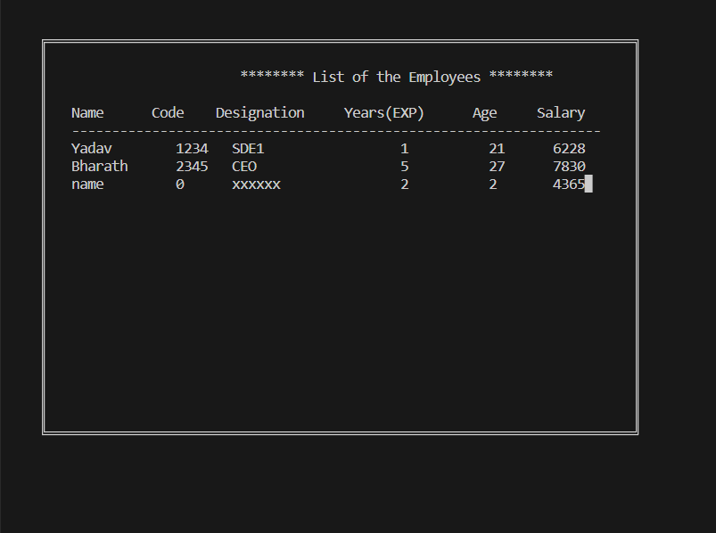

# Payroll Management System

The Payroll Management System is a command-line application that allows users to manage employee records and perform various operations related to payroll management. The system provides the following features:

## Features

1. **Add/Insert Employee Record:** Users can add new employee records to the system.

2. **Edit and Delete Record:** Employee records can be edited and deleted as needed.

3. **Search Employee Record:** Users can search for specific employee records using relevant criteria.

4. **Display Employee List:** The system can display the list of all employees in the table.

5. **Print Employee Payslip:** Users have the option to print payslips for employees.

6. **Quit Program:** Users can exit the program gracefully.

## User Interface

The user interacts with the program by selecting an option based on the operation they want to perform. Depending on the chosen option, the user will be prompted to enter relevant information to complete the operation.

## How to Use

1. Load and login to the system.

2. Once logged in, the main menu will be displayed.

3. Choose an option based on the desired operation:
   - Press `i` to insert a new employee record.
   - Press `e` to edit an existing employee record.
   - Press `d` to delete an employee record.
   - Press `s` to search for a specific employee record.
   - Press `l` to list all employees.
   - Press `p` to print an employee payslip.
   - Press `q` to quit the program.

4. Follow the prompts to complete the chosen operation.

## Dependencies

This program doesn't require any external dependencies beyond the standard C++ library.

## Compatibility

The program runs on the command-line interface and should be compatible with most operating systems.

## Usage Example

